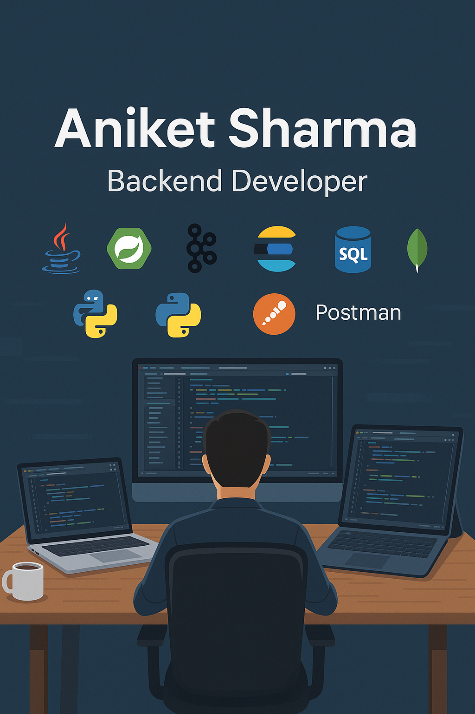

<h1 align="center">Hi 👋, I'm Aniket Sharma</h1>
<h3 align="center">Senior Software Engineer 2 | Backend Specialist | Tech Enthusiast</h3>

  
  
  
  

---

### 🔭 Current Role

👨‍💻 **Senior Software Engineer 2** at **Payoda (Apple Maps Team)**  
📍 Hyderabad, India  
🗓️ *May 2024 – Present*

- Streamlined task prioritization for editors using a todo-scoring system.
- Automated narrow road identification to enhance map accuracy.
- Added relative timestamp filters for better project planning.
- Developed Elastic Search reindex and migration optimization scripts.

---

### 🧳 Past Experience

**SDE 2 – BeepKart**  
📍 Bengaluru | *Feb 2024 – May 2024*  
- Developed offer/add-on combos and lender recommendation systems.  
- Implemented Debezium for real-time data synchronization.

**Senior Software Engineer – LeadSquared**  
📍 Bengaluru | *Apr 2023 – Feb 2024*  
- Integrated telephony with ticketing systems.  
- Dynamic ticket/chatbot assignment to balance agent workload.

**Software Engineer – LeadSquared**  
📍 Bengaluru | *Jul 2021 – Mar 2023*  
- Built scalable systems processing 4B+ records/day using Kafka + Spring Boot.  
- Designed Data Converter Module for custom data enrichment.

**Intern – LeadSquared**  
📍 Bengaluru | *Jul 2020 – Jun 2021*  
- Set up automated API testing with Postman.  
- Contributed to Elasticsearch-backed internal tools.

---

### 🎓 Education

🎓 **BTech in Computer Science** – Lovely Professional University (2017–2021) — *89.6%*  
🏫 **Senior Secondary** – Minerva Sr. Sec. School — *92.2%*  
🏫 **Secondary** – Minerva Sr. Sec. School — *92.8%*

---

### 🛠️ Skills & Tools

  

- `Java (Spring Boot)` | `Scala` | `Kafka` | `Elastic Search` | `Redis`
- `MongoDB` | `PostgreSQL` | `SQL` | `AWS` | `Microservices`
- `Postman` | `Debezium` | `Agile Development` | `Flyway` | `Reactive Spring`

---

### ✍️ Articles

📝 **Latest Technical Writings on Medium**  
- 📦 [Postman 101: Beyond Sending Requests](https://medium.com/@minervaaniket/postman-101-beyond-sending-requests-70ad42f14780)  
- 🌸 [Bloom Filter vs HashSet vs Trie in Scala](https://medium.com/@minervaaniket/bloom-filter-vs-hashset-vs-trie-in-scala-use-cases-trade-offs-and-code-47c5c3be1a2b)  
- 🔄 [Apache Kafka Deep Dive](https://medium.com/@minervaaniket/apache-kafka-a-deep-dive-into-its-architecture-and-workflow-510709dff298)  
- ⚙️ [Kafka Offset Reset Strategies](https://medium.com/@minervaaniket/kafka-offset-reset-demystified-strategies-commands-and-use-cases-72a938376078)  
- 👥 [Kafka Consumer Groups](https://medium.com/@minervaaniket/kafka-consumer-groups-should-you-use-one-or-many-c9d2ca62baf0)  
- ☕ [SOLID Principles in Java](https://medium.com/@minervaaniket/single-responsibility-solid-principle-java-30c07376b84d)  
- 🔧 [Lombok Annotations in Spring Boot](https://medium.com/@minervaaniket/lombok-annotations-usage-02ff1723e6be)  
- 📡 [Real-Time Data with Debezium](https://medium.com/@minervaaniket/unleashing-real-time-data-power-a-guide-to-debezium-b5fed2881a47)  
- 🔄 [Scala: map & flatMap](https://medium.com/@minervaaniket/map-flatmap-scala-fc3a43ee5cd8)  
- 🧩 [Scala Pattern Matching](https://medium.com/@minervaaniket/unboxing-scalas-match-feature-176cec528d53)  
- 🎯 [Scala vs Java: Classes and Objects](https://medium.com/@minervaaniket/scala-demystified-understanding-class-case-class-object-and-app-with-java-comparisons-a6c54ee8e3a8)

---

### 🤝 Let's Connect

- 📫 Email: **minervaaniket@gmail.com**
- 💬 Ask me about: **Backend Systems, Kafka, Distributed Architecture, Scala, Spring**
- 🌱 Currently learning: **Distributed Systems, Compiler Internals, Functional Programming**

---

<b>Thanks for stopping by! 🙏 Stay tuned for more projects and blogs.</b>

